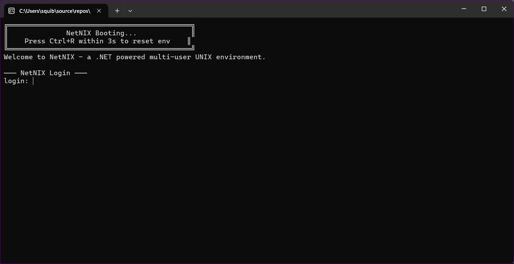

<p align="center">
  <p align="center">
    
  </p>

  <h1 align="center">NetNIX</h1>

<p align="center">
  A multi-user UNIX-like operating environment built entirely in C# on .NET 8.
</p>

---

NetNIX simulates a complete UNIX experience inside your terminal — with a virtual filesystem, user accounts, a shell, file permissions, a text editor, networking, background daemons, a package manager, and a C# scripting engine that lets you write and run scripts directly inside the environment.

Everything lives in a single portable zip archive on your host OS. No admin rights, no VMs, no containers.

## Screenshots

<p align="center">
  <br/>
  <em>Login prompt and boot sequence</em>
</p>

<p align="center">
  <br/>
  <em>Basic UNIX commands — navigating the virtual filesystem</em>
</p>

<p align="center">
  <br/>
  <em>File operations — creating, reading, and managing files</em>
</p>

<p align="center">
  <br/>
  <em>Advanced filesystem operations</em>
</p>

<p align="center">
  <br/>
  <em>Available commands and help system</em>
</p>

<p align="center">
  <br/>
  <em>Multi-user support — creating users and using <code>sudo</code></em>
</p>

<p align="center">
  <br/>
  <em>Per-user shell startup scripts (<code>~/.nshrc</code>)</em>
</p>

<p align="center">
  <br/>
  <em>Comprehensive manual pages — 83 built-in topics</em>
</p>

<p align="center">
  <br/>
  <em>Detailed command documentation with examples</em>
</p>

<p align="center">
  <br/>
  <em>Library and archive documentation</em>
</p>

<p align="center">
  <br/>
  <em>Mounting host zip archives into the VFS with <code>mount</code></em>
</p>

<p align="center">
  <br/>
  <em>Full mount/unmount lifecycle — read-only and read-write support</em>
</p>

<p align="center">
  <br/>
  <em>Package manager (<code>npak</code>) — building and installing packages</em>
</p>

<p align="center">
  <br/>
  <em>Package manager — listing, inspecting, and removing packages</em>
</p>

<p align="center">
  <br/>
  <em>Sandbox security — <code>/etc/sandbox.conf</code> controls blocked APIs</em>
</p>

<p align="center">
  <br/>
  <em>Per-script sandbox exceptions — granting trusted daemons access to blocked APIs</em>
</p>

---

## What's New

### Telnet Remote Access (telnetd)
Full multi-user remote access via the Telnet protocol. Multiple users can connect simultaneously from any Telnet client (PuTTY, Linux `telnet`, Windows `telnet`, Tera Term, etc.) and get a complete shell session with all commands, the text editor, and scripting — all sharing the same virtual filesystem.

```
root# daemon start telnetd
telnetd: listening on port 2323 (term 80x24, max 8 sessions)

# From another machine:
telnet yourhost 2323
```

Features:
- Full nsh shell over Telnet with ANSI terminal support
- Multiple simultaneous sessions, each on its own thread
- Login authentication using NetNIX user accounts
- Automatic terminal size detection via NAWS protocol negotiation
- Configurable session limits, idle timeout, and login attempts
- Customisable login banner and welcome message
- Graceful disconnect handling — remote sessions can never crash the host
- Cross-platform: works on Windows, Linux, and macOS

### Daemon Configuration Files
Both `telnetd` and `httpd` now read configuration from files in `/etc/`:

- **`/etc/telnetd.conf`** — port, terminal dimensions, session limits, idle timeout, banners, logging
- **`/etc/httpd.conf`** — port, web root, default page, logging

Config files are plain text (`key = value` format), installed automatically from the `Factory/etc/` directory, and editable in the IDE or via `edit` inside NetNIX. Admin customisations are preserved across updates — factory setup never overwrites existing `.conf` files.

```
# Example /etc/telnetd.conf
port = 2323
terminal_width = 120
terminal_height = 40
max_sessions = 16
idle_timeout = 60
login_banner = My Server
log_sessions = true
host_log_events = true
```

### Dual Logging System
Both `telnetd` and `httpd` support logging to two destinations:

| Setting | Destination | Audience |
|---------|-------------|----------|
| `log_events` | `/var/log/<daemon>.log` (VFS) | Root users inside NetNIX |
| `log_sessions` | `/var/log/telnetd/<user>.log` (VFS) | Root users inside NetNIX |
| `host_log_events` | `logs/<daemon>.log` (host filesystem) | Host machine operator |
| `host_log_sessions` | `logs/telnetd-<user>.log` (host filesystem) | Host machine operator |

VFS logs are restricted to root (`rw-------`). Host logs are written to a `logs/` directory next to the executable via the new `api.HostLog()` API.

### Cross-Platform Support
The telnetd daemon and all networking code use standard cross-platform .NET APIs. NetNIX runs on:
- **Windows** (Windows 10/11, Server 2016+)
- **Linux** (any distro with .NET 8 runtime)
- **macOS** (with .NET 8 runtime)

### Editor Improvements
- **Horizontal scrolling** — lines longer than the terminal width now scroll automatically. The gutter shows `<|` when scrolled right.
- **Remote session support** — the editor uses `SessionIO.WindowWidth`/`WindowHeight` for correct sizing over Telnet, with automatic NAWS-based terminal size detection.
- **Clean disconnect handling** — if a remote client disconnects mid-edit, the editor exits gracefully without crashing the host.

### Session I/O Safety
`SessionIO` now wraps all remote I/O with exception-safe wrappers:
- **`SafeRemoteWriter`** — silently swallows write exceptions on disconnect
- **`SafeRemoteReader`** — returns `null`/EOF on disconnect instead of throwing
- **`ReadKey`** — returns Escape on disconnect instead of throwing
- No exception from any remote session can ever propagate to crash the host process

### New NixApi Methods
| Method | Description |
|--------|-------------|
| `api.Chmod(path, permissions)` | Change file/directory permissions (owner or root only) |
| `api.HostLog(category, message)` | Write timestamped log to host `logs/` directory |
| `api.HostLogRaw(category, text)` | Write raw text to host log (for transcripts) |

### Background Daemons
Run long-lived background processes inside NetNIX. Daemons are C# scripts with a `Daemon()` entry point that run on background threads with graceful shutdown support via `CancellationToken`.

```
root# daemon start httpd 8080
httpd: listening on http://localhost:8080/  (web root: /var/www)
daemon: started 'httpd' (pid 1000)

root# daemon list
PID      NAME             STATUS     OWNER      STARTED
1000     httpd            running    root       14:32:05

root# daemon stop httpd
daemon: 'httpd' stopped
```

Write your own daemons — run `man daemon-writing` inside NetNIX for a complete guide with three copy-paste templates (minimal daemon, HTTP server, file watcher).

### Built-in HTTP Server (httpd)
A working HTTP file server daemon that serves the virtual filesystem over localhost. Supports directory listings, content-type detection, configurable port, web root, default page, and request logging. Configuration in `/etc/httpd.conf`.

```
root# daemon start httpd
httpd: listening on http://localhost:8080/  (web root: /var/www)
# Visit http://localhost:8080/ in your browser
```

### Sandbox with Controlled Exceptions
The security sandbox blocks scripts from accessing `System.IO`, `System.Net`, `System.Diagnostics`, `System.Reflection`, and other dangerous APIs. Root can now grant individual scripts controlled exceptions via `/etc/sandbox.exceptions` — without weakening the sandbox for everything else:

```
# /etc/sandbox.exceptions — root only
httpd  System.Net
httpd  HttpListener(
```

The compiler automatically adds the required .NET assemblies when exceptions are granted.

### Settings Library (settingslib)
A key=value settings API for applications. Per-user settings stored in `~/.config/<app>.conf`, system-wide in `/etc/opt/<app>.conf`. Per-user values override system-wide defaults.

```csharp
#include <settingslib>

Settings.Set(api, "myapp", "theme", "dark");
string theme = Settings.GetEffective(api, "myapp", "theme", "light");
```

Run `settings-demo` for an interactive walkthrough.

### Mount and Unmount
Mount `.zip` archives from the host OS directly into the VFS, with read-only or read-write support:

```
root# mount archive.zip /mnt/data              # read-only mount
root# mount --rw writable.zip /mnt/work        # read-write mount
root# ls /mnt/data
root# umount --save /mnt/work                  # save changes & unmount
```

### VFS Export and Host Import
Export the entire virtual filesystem (or a subtree) to a zip on the host, or import individual files from the host:

```
root# export C:\Backups\netnix-backup.zip       # full VFS export
root# export C:\Backups\home.zip /home           # export subtree
root# importfile C:\data\notes.txt /tmp/notes.txt
```

### Package Manager (npak)
Install, remove, and manage `.npak` packages. Packages can contain scripts, libraries, and man pages:

```
root# npak install /tmp/hello.npak
root# npak list
root# npak info hello
root# npak remove hello
```

Run `npak-demo` as root for an interactive walkthrough.

### Factory Reinstall
Restore all built-in commands, libraries, and man pages to factory defaults without losing user data:

```
root# reinstall
```

### Bug Fixes
- Root-only commands now check permissions early and print friendly error messages instead of crashing with unhandled exceptions
- User/group operations fail gracefully with descriptive console output
- Commands that require root no longer print false success messages when run by a non-root user
- Root-only commands are properly installed to `/sbin` instead of `/bin`

---

## Features

### Virtual Filesystem
- Full UNIX directory hierarchy (`/bin`, `/sbin`, `/etc`, `/home`, `/lib`, `/mnt`, `/usr`, `/var`, `/tmp`, etc.)
- Backed by a single `.zip` archive stored in your OS `AppData` folder
- Supports files and directories with metadata (owner, group, permissions)
- Standard path operations: absolute, relative, `.`, `..`, `~`
- Mount external `.zip` archives into the VFS at runtime
- Import files from the host OS, export the VFS to zip

### Multi-User System
- `/etc/passwd` and `/etc/shadow` based user/group management
- SHA-256 password hashing
- Root account (uid 0) with full system access
- `sudo` support for users in the `sudo` group
- Standard user accounts with isolated home directories (`/home/<user>`)
- Per-user and per-group primary groups
- User locking/unlocking
- Login prompt with masked password input
- Shell builtins: `adduser`, `deluser`, `passwd`, `su`, `sudo`, `users`, `groups`
- Admin commands in `/sbin`: `useradd`, `userdel`, `usermod`, `groupadd`, `groupdel`, `groupmod`

### UNIX File Permissions
- Full `rwxrwxrwx` (owner/group/other) permission model
- Enforced on all file and directory operations (read, write, create, delete, move, copy, list)
- Directory traverse (execute) permission checking along the full path
- `chmod` with symbolic (`rwxr-xr-x`) or octal (`755`) notation
- `chown` for changing file ownership (root only)
- Home directories default to `rwx------` (700) — private to each user
- Root bypasses all permission checks

### Interactive Shell (nsh)
- Prompt shows `user@netnix:/path$` (or `#` for root)
- Quoting support (single and double quotes)
- Output redirection (`>` and `>>`) with permission checks
- Shell variable expansion: `$USER`, `$UID`, `$GID`, `$HOME`, `$PWD`, `$CWD`, `$SHELL`, `$HOSTNAME`, `~`
- Startup scripts (`~/.nshrc`) run automatically on login
- `source` / `.` to run shell scripts (one command per line)
- Script search path: cwd ? `/bin` ? `/sbin` ? `/usr/bin` ? `/usr/sbin` ? `/usr/local/bin` ? `/usr/local/sbin`

### Security Sandbox
- Scripts are blocked from using `System.IO`, `System.Net`, `System.Diagnostics`, `System.Reflection`, and more
- Three-layer enforcement: blocked usings, blocked API tokens, assembly allowlist
- Root-editable rules in `/etc/sandbox.conf`
- Per-script exceptions in `/etc/sandbox.exceptions` for trusted daemons and tools
- Extra .NET assemblies automatically added based on granted exceptions

### Daemon System
- Background process management: `daemon start`, `stop`, `list`, `status`
- Daemons implement `static int Daemon(NixApi api, string[] args)`
- Graceful shutdown via `api.DaemonToken` (CancellationToken)
- Built-in `telnetd` Telnet server and `httpd` web server daemons
- Configuration files in `/etc/` (managed via `Factory/etc/` in the project)
- Dual logging: VFS logs for root, host filesystem logs for operators
- Daemon threads have catch-all exception handling — can never crash the host
- Full tutorial with three copy-paste templates: `man daemon-writing`

### Package Manager (npak)
- `.npak` files are zip archives with `manifest.txt`, `bin/`, `lib/`, `man/`
- Install packages to `/usr/local/bin`, `/usr/local/lib`, `/usr/share/man`
- Install, remove, list, and inspect packages
- Interactive demo: `npak-demo`

### Settings Library (settingslib)
- Per-user settings in `~/.config/<app>.conf`
- System-wide settings in `/etc/opt/<app>.conf` (root-only writes)
- `GetEffective()` — per-user overrides system-wide with fallback
- Interactive demo: `settings-demo`

### Built-in Shell Commands
| Command | Description |
|---------|-------------|
| `help` | Show command summary |
| `man` | Manual pages (`man <topic>`, `man -k <keyword>`, `man --list`) |
| `cd` | Change directory (`cd`, `cd ~`, `cd -`, `cd ..`) |
| `edit` | Full-screen text editor (nano-inspired) |
| `write` | Write text to a file interactively |
| `chmod` | Change file permissions |
| `chown` | Change file ownership (root only) |
| `stat` | Display file/directory metadata |
| `tree` | Display directory tree |
| `adduser` / `deluser` | Create / delete users (root only) |
| `passwd` | Change passwords |
| `su` / `sudo` | Switch user / run command as root |
| `users` / `groups` | List all users / groups |
| `daemon` | Manage background daemons |
| `run` | Run a C# script file |
| `source` / `.` | Execute a shell script |
| `clear` | Clear the screen |
| `exit` / `logout` | End the session |

### Script Commands (`/bin/*.cs`)
All of these are plain C# source files compiled and executed at runtime:

| Category | Commands |
|----------|----------|
| **Files** | `ls`, `cat`, `cp`, `mv`, `rm`, `mkdir`, `rmdir`, `touch` |
| **Text** | `head`, `tail`, `wc`, `grep`, `find`, `tee`, `echo` |
| **Path** | `pwd`, `basename`, `dirname` |
| **System** | `whoami`, `id`, `uname`, `hostname`, `date`, `env`, `du`, `df` |
| **Networking** | `curl`, `wget`, `fetch` |
| **Clipboard** | `cbcopy`, `cbpaste` |
| **Archives** | `zip`, `unzip` |
| **Misc** | `yes`, `true`, `false` |
| **Demos** | `demo`, `demoapitest`, `settings-demo` |

### System Admin Commands (`/sbin/*.cs` — root/sudo only)
| Category | Commands |
|----------|----------|
| **Users & Groups** | `useradd`, `userdel`, `usermod`, `groupadd`, `groupdel`, `groupmod` |
| **Host Filesystem** | `mount`, `umount`, `export`, `importfile` |
| **Packages** | `npak`, `npak-demo` |
| **Daemons** | `httpd`, `telnetd` |
| **System** | `reinstall` |

### Shared Libraries (`/lib`)
| Library | Include Directive | Description |
|---------|-------------------|-------------|
| `netlib` | `#include <netlib>` | HTTP/networking helpers |
| `ziplib` | `#include <ziplib>` | Zip archive utilities |
| `settingslib` | `#include <settingslib>` | Per-user and system-wide app settings |
| `demoapilib` | `#include <demoapilib>` | Demo/example API library |

### C# Scripting Engine
- Write scripts as plain `.cs` files stored anywhere in the VFS
- Scripts define a class with `static int Run(NixApi api, string[] args)`
- Compiled at runtime using Roslyn (`Microsoft.CodeAnalysis.CSharp`)
- Compiled assemblies are cached in memory for performance
- Rich `NixApi` surface for filesystem, user, networking, daemon, and archive operations
- `#include <libname>` / `#include "path"` preprocessor for shared libraries
- Libraries stored in `/lib`, `/usr/lib`, `/usr/local/lib`

### Networking
- HTTP GET, POST, and form-POST from scripts via `api.Net`
- `curl`, `wget`, `fetch` commands for downloading content
- `api.Download()` / `api.DownloadText()` to save URLs to the VFS

### 83 Manual Pages
Comprehensive `man` pages for every command, library, and topic:

| Topic | Description |
|-------|-------------|
| `man api` | Full NixApi scripting reference |
| `man scripting` | How to write C# scripts |
| `man daemon` | Daemon management commands |
| `man daemon-writing` | How to write daemons (with templates) |
| `man httpd` | HTTP server daemon |
| `man telnetd` | Telnet server daemon (remote access) |
| `man sandbox` | Script sandbox security |
| `man sandbox.exceptions` | Per-script sandbox overrides |
| `man settingslib` | Settings library API |
| `man include` | Library `#include` system |
| `man filesystem` | Filesystem hierarchy |
| `man permissions` | File permission system |
| `man editor` | Text editor guide |
| `man nshrc` | Shell startup scripts |

### Environment Reset
- Press `Ctrl+R` during the 3-second boot window to reset the entire environment
- Or type `__reset__` at the login prompt
- Wipes the filesystem archive and re-runs first-time setup

---

## Getting Started

### Prerequisites
- [.NET 8 SDK](https://dotnet.microsoft.com/download/dotnet/8.0)

### Build & Run
```bash
git clone https://github.com/squiblez/NetNIX.git
cd NetNIX
dotnet run --project NetNIX
```

### First Run
On first launch, NetNIX runs a setup wizard that:
1. Creates the standard UNIX directory hierarchy
2. Installs default shell startup scripts and skeleton files (`/etc/skel`)
3. Prompts you to set a **root password**
4. Optionally creates a **regular user** account (with optional `sudo` membership)
5. Installs commands in `/bin` and `/sbin`, libraries in `/lib`, man pages in `/usr/share/man`
6. Installs sandbox configuration (`/etc/sandbox.conf`, `/etc/sandbox.exceptions`)
7. Saves everything to `%APPDATA%/NetNIX/rootfs.zip`

### Quick Tour
```
root@netnix:~# help                        # see all commands
root@netnix:~# man ls                      # read the ls manual page
root@netnix:~# ls /                        # list root directory
root@netnix:~# adduser alice               # create a user
root@netnix:~# su alice                    # switch to alice
alice@netnix:~$ whoami                      # confirm identity
alice@netnix:~$ echo "hello" > greeting.txt
alice@netnix:~$ cat greeting.txt
alice@netnix:~$ edit notes.txt             # open the text editor
alice@netnix:~$ tree ~                     # show home directory tree
alice@netnix:~$ man scripting              # learn to write C# scripts
alice@netnix:~$ exit                       # log out
```

---

## How-To Guides

### Writing a C# Script
Create a file (e.g. `edit ~/hello.cs`) with:
```csharp
using System;
using NetNIX.Scripting;

public static class HelloCommand
{
    public static int Run(NixApi api, string[] args)
    {
        Console.WriteLine($"Hello from {api.Username}! You are in {api.Cwd}");
        return 0;
    }
}
```
Then run it:
```
alice@netnix:~$ run ~/hello.cs
Hello from alice! You are in /home/alice
```

Install it as a global command:
```
root@netnix:~# cp /home/alice/hello.cs /bin/hello.cs
root@netnix:~# hello          # now available system-wide
```

### Writing a Background Daemon
Create `/sbin/mydaemon.cs`:
```csharp
using System;
using System.Threading;
using NetNIX.Scripting;

public static class MyDaemon
{
    public static int Daemon(NixApi api, string[] args)
    {
        Console.WriteLine("mydaemon: started");
        while (!api.DaemonToken.IsCancellationRequested)
        {
            // Your background logic here
            try
            {
                Task.Delay(5000, api.DaemonToken).GetAwaiter().GetResult();
            }
            catch (OperationCanceledException) { break; }
        }
        Console.WriteLine("mydaemon: stopped");
        return 0;
    }

    public static int Run(NixApi api, string[] args)
    {
        Console.WriteLine("Start with: daemon start mydaemon");
        return 0;
    }
}
```
Then:
```
root# daemon start mydaemon
daemon: started 'mydaemon' (pid 1000)
root# daemon list
root# daemon stop mydaemon
```

Run `man daemon-writing` for three complete templates including an HTTP server and a file watcher.

### Starting the Telnet Server
```
root# edit /etc/telnetd.conf            # customise port, limits, banner, logging
root# daemon start telnetd
telnetd: listening on port 2323 (term 80x24, max 8 sessions)

# Connect from any Telnet client:
telnet localhost 2323
# Or use PuTTY, Tera Term, etc.

root# daemon stop telnetd
```

Configuration highlights (`/etc/telnetd.conf`):
```
port = 2323              # TCP port
terminal_width = 80      # default terminal columns
terminal_height = 24     # default terminal rows (overridden by client NAWS)
max_sessions = 8         # concurrent session limit (0 = unlimited)
idle_timeout = 30        # minutes before idle disconnect (0 = never)
log_sessions = true      # log per-user activity to /var/log/telnetd/<user>.log
host_log_events = true   # mirror daemon events to host logs/ directory
```

### Starting the HTTP Server
```
root# edit /etc/httpd.conf              # customise port, web root, logging
root# daemon start httpd
httpd: listening on http://localhost:8080/  (web root: /var/www)

root# echo "<h1>Hello World</h1>" > /var/www/index.html
# Visit http://localhost:8080/ in your browser

root# daemon stop httpd
```

### Using the Settings Library
```csharp
#include <settingslib>

// Per-user settings (stored in ~/.config/myapp.conf)
Settings.Set(api, "myapp", "theme", "dark");
Settings.Set(api, "myapp", "language", "en");
string theme = Settings.Get(api, "myapp", "theme", "light");

// System-wide settings (stored in /etc/opt/myapp.conf, root-only writes)
Settings.SetSystem(api, "myapp", "max_retries", "3");

// Effective value: per-user wins over system-wide
string val = Settings.GetEffective(api, "myapp", "theme", "default");
```

### Mounting a Host Zip Archive
```
root# mount C:\Data\photos.zip /mnt/photos
root# ls /mnt/photos
root# cat /mnt/photos/readme.txt
root# umount /mnt/photos
```

### Importing and Exporting Files
```
root# importfile C:\Users\me\report.txt /home/alice/report.txt
root# export C:\Backups\netnix.zip             # full VFS
root# export C:\Backups\alice.zip /home/alice   # just alice's home
```

### Installing a Package
```
root# npak install /tmp/mypackage.npak
root# npak list
root# npak info mypackage
root# npak remove mypackage
```

Run `npak-demo` as root for a full walkthrough that creates, builds, installs, tests, and removes a package.

### Using Shared Libraries
```csharp
#include <netlib>
// HTTP helpers: NetLib.GetOrDefault(), NetLib.Ping(), etc.

#include <ziplib>
// Zip utilities: ZipLib.ZipDirectory(), ZipLib.ExtractTo(), etc.

#include <settingslib>
// App settings: Settings.Get(), Settings.Set(), etc.
```

---

## Data Storage
All filesystem state is persisted in a single zip archive at:
```
%APPDATA%\NetNIX\rootfs.zip        (Windows)
~/.config/NetNIX/rootfs.zip        (Linux/macOS)
```

File metadata (owners, groups, permissions) is stored in a `.vfsmeta` entry inside the archive.

## Project Structure
```
NetNIX/
|-- Program.cs                  # Entry point - boot, login loop, reset
|-- Shell/
|   |-- NixShell.cs             # Interactive shell (nsh) + daemon management
|   |-- SessionIO.cs            # Thread-safe per-session I/O (local + remote)
|-- VFS/
|   |-- VirtualFileSystem.cs    # Zip-backed virtual filesystem + mount system
|   |-- VfsNode.cs              # File/directory node with permissions
|-- Users/
|   |-- UserManager.cs          # User & group CRUD, /etc/passwd, /etc/shadow
|   |-- UserRecord.cs           # User account model
|   |-- GroupRecord.cs          # Group model
|-- Scripting/
|   |-- ScriptRunner.cs         # Roslyn compiler + sandbox + exceptions system
|   |-- NixApi.cs               # API surface exposed to scripts
|   |-- NixNet.cs               # Networking API (HTTP client)
|   |-- DaemonManager.cs        # Background daemon lifecycle manager
|-- Config/
|   |-- NxConfig.cs             # Host-side environment configuration
|-- Setup/
|   |-- FirstRunSetup.cs        # First-run wizard
|   |-- BuiltinScripts.cs       # Loader for /bin + /sbin commands
|   |-- BuiltinLibs.cs          # Loader for /lib libraries
|   |-- BuiltinManPages.cs      # Loader for man pages from helpman/
|   |-- FactoryFiles.cs         # Loader for Factory/ config files
|-- Builtins/                   # C# source for /bin commands (compiled at runtime)
|   |-- ls.cs, cat.cs, grep.cs, curl.cs, edit.cs, ...
|-- SystemBuiltins/             # C# source for /sbin commands (root only)
|   |-- httpd.cs, telnetd.cs, mount.cs, npak.cs, reinstall.cs, ...
|-- Factory/                    # Default config files installed to /etc/
|   |-- etc/
|       |-- telnetd.conf        # Telnet daemon configuration
|       |-- httpd.conf          # HTTP daemon configuration
|-- Libs/                       # C# source for shared libraries
|   |-- netlib.cs, ziplib.cs, settingslib.cs, demoapilib.cs
|-- helpman/                    # Plain-text man pages (83+ pages)
    |-- ls.txt, daemon.txt, telnetd.txt, httpd.txt, ...
```

> **Note:** Files in `Builtins/`, `SystemBuiltins/`, `Factory/`, `Libs/`, and `helpman/` are **not** compiled as part of the .NET project. They are copied to the output directory as content files and installed into the VFS at first run. Scripts are compiled at runtime by the Roslyn scripting engine. Config files in `Factory/etc/` are only installed if they don't already exist, preserving admin customisations.

## Technology
- **.NET 8** console application
- **Roslyn** (`Microsoft.CodeAnalysis.CSharp`) for runtime C# script compilation
- **System.IO.Compression** for the zip-backed virtual filesystem
- No external dependencies beyond the Roslyn compiler package

## License
See [LICENSE](LICENSE) for details.

## AI
Artificial intelligence was used largely in the implementation of this project 